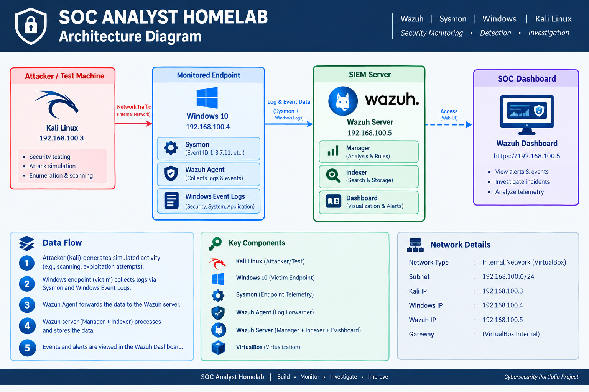
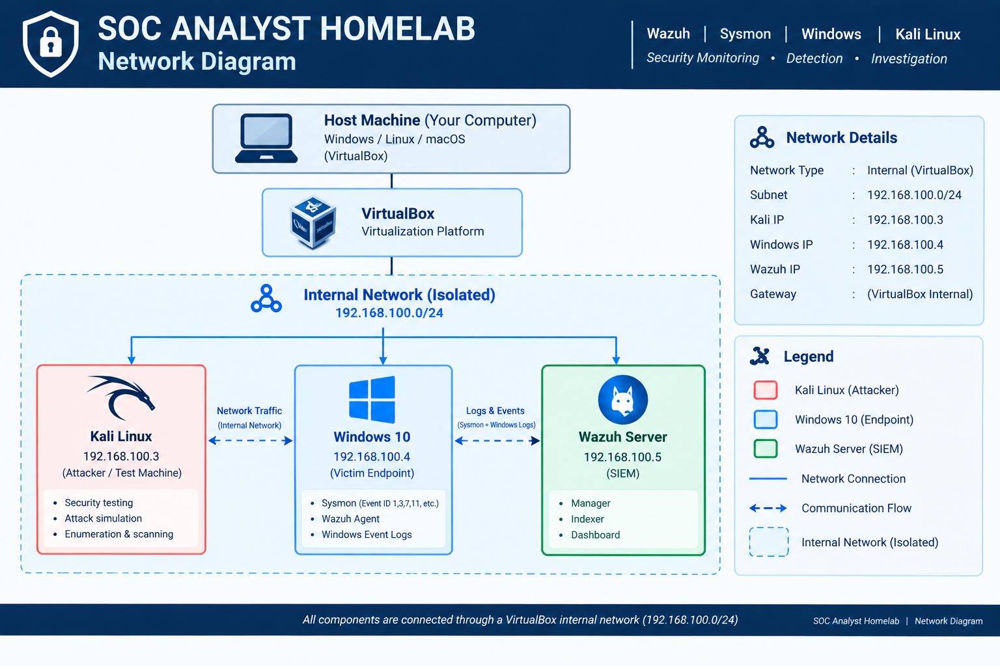

# 🛡️ SOC Analyst Homelab

A hands-on Security Operations Center (SOC) homelab built to practice **SIEM monitoring, Windows endpoint telemetry, Sysmon analysis, log investigation, and SOC workflows** using an isolated virtual environment.

The lab integrates **Windows 10, Sysmon, Wazuh Agent, Wazuh SIEM, and Kali Linux** to create an endpoint-to-SIEM monitoring pipeline for defensive cybersecurity practice.

> **Project 1 Status:** ✅ Completed — End-to-end Windows and Sysmon telemetry successfully validated in Wazuh.

---

## 🏗️ Lab Architecture



The environment consists of three virtual machines connected through an isolated VirtualBox Internal Network.

```text
                    Physical Host
                         |
                    VirtualBox
                         |
                         v
              Internal Network
               192.168.100.0/24
                         |
          +--------------+--------------+
          |              |              |
          v              v              v
     Kali Linux      Windows 10       Wazuh
    192.168.100.3   192.168.100.4   192.168.100.5
      Testing         Endpoint          SIEM
                      |
                Sysmon + Wazuh Agent
```

### Network Diagram



---

## 🖥️ Lab Environment

| Component | Role | IP Address |
|---|---|---|
| Kali Linux | Security Testing / Attacker Simulation | `192.168.100.3` |
| Windows 10 | Victim / Monitored Endpoint | `192.168.100.4` |
| Wazuh Server | SIEM / Security Monitoring | `192.168.100.5` |
| Sysmon | Enhanced Windows Endpoint Telemetry | Windows Endpoint |
| Wazuh Agent | Log Collection and Forwarding | Windows Endpoint |
| VirtualBox | Virtualization Platform | Host System |

---

## 🔄 Telemetry Pipeline

The validated monitoring pipeline is:

```text
Windows Activity
       ↓
Sysmon / Windows Event Logs
       ↓
Wazuh Agent
       ↓
Wazuh Server
       ↓
Wazuh Indexer
       ↓
Wazuh Dashboard
       ↓
SOC Investigation
```

This allows activity generated on the monitored Windows endpoint to be collected and analyzed centrally through Wazuh.

---

## ✅ Project 1 — SIEM & Endpoint Monitoring

The first phase of the homelab focused on building and validating the monitoring infrastructure.

Completed objectives:

- Built an isolated three-VM cybersecurity lab.
- Configured the `192.168.100.0/24` internal network.
- Deployed a Windows 10 monitored endpoint.
- Installed and validated Sysmon.
- Installed and connected the Wazuh Agent.
- Deployed Wazuh for centralized security monitoring.
- Verified Windows Security event generation.
- Configured Sysmon Operational event collection.
- Verified Windows telemetry ingestion into Wazuh.
- Generated benign `notepad.exe` process activity.
- Verified Sysmon Process Creation telemetry in Wazuh.
- Troubleshot the Sysmon-to-Wazuh telemetry pipeline.
- Documented the architecture, configuration, testing, and troubleshooting process.

---

## 🧪 Validation Results

| Test | Result |
|---|---|
| Internal network connectivity | ✅ PASS |
| Wazuh Dashboard accessible | ✅ PASS |
| Windows Wazuh Agent active | ✅ PASS |
| Sysmon events generated locally | ✅ PASS |
| Windows Security events available | ✅ PASS |
| Windows events visible in Wazuh | ✅ PASS |
| Sysmon process telemetry visible in Wazuh | ✅ PASS |

**Overall validation: 7 / 7 tests passed.**

---

## 📸 Evidence

Validation evidence is available in the [`screenshots/`](screenshots/) directory.

Evidence includes:

- Wazuh Dashboard access
- Operational Wazuh Dashboard
- Active Windows Wazuh Agent
- Sysmon Operational events
- Windows Security events
- Windows telemetry in Wazuh
- Sysmon process telemetry in Wazuh

---

## 📚 Documentation

Detailed project documentation is available in the [`documentation/`](documentation/) directory.

| Document | Description |
|---|---|
| [01 — Lab Objectives](documentation/01-lab-objectives.md) | Project goals and SOC learning objectives |
| [02 — Requirements](documentation/02-requirements.md) | Lab, system, monitoring, and security requirements |
| [03 — Network Design](documentation/03-network-design.md) | Virtual network architecture and communication flow |
| [04 — Wazuh Deployment](documentation/04-wazuh-deployment.md) | Wazuh SIEM deployment and validation |
| [05 — Windows Endpoint](documentation/05-windows-endpoint.md) | Windows monitoring configuration |
| [06 — Sysmon Deployment](documentation/06-sysmon-deployment.md) | Sysmon telemetry deployment and validation |
| [07 — Wazuh Agent](documentation/07-wazuh-agent.md) | Agent configuration and event collection |
| [08 — Testing](documentation/08-testing.md) | End-to-end testing and validation |
| [09 — Troubleshooting](documentation/09-troubleshooting.md) | Sysmon telemetry troubleshooting |

---

## ⚙️ Configuration

Sanitized configuration documentation is available under [`configuration/`](configuration/).

```text
configuration/
├── sysmon/
│   └── README.md
└── wazuh/
    └── README.md
```

The repository intentionally excludes credentials, authentication secrets, private keys, VM disk images, and other sensitive information.

---

## 🔍 SOC Skills Demonstrated

This project demonstrates hands-on experience with:

- SIEM monitoring
- Wazuh
- Windows Event Logs
- Sysmon
- Endpoint telemetry
- Log collection and forwarding
- Process execution analysis
- Event investigation
- Telemetry validation
- Troubleshooting visibility gaps
- Network isolation
- Security documentation
- Git/GitHub documentation workflow

---

## 🚀 Future SOC Projects

This homelab will serve as the foundation for additional SOC analyst investigations.

Planned projects include:

### Project 2 — Brute-Force Detection
Generate controlled authentication activity and investigate failed login events using Wazuh.

### Project 3 — Suspicious Execution / PowerShell Investigation
Analyze suspicious process and PowerShell activity using Windows and Sysmon telemetry.

### Project 4 — Phishing Investigation
Simulate and investigate a controlled phishing-related security scenario.

### Project 5 — Threat Hunting & MITRE ATT&CK
Perform structured threat hunting and map observed behaviors to relevant MITRE ATT&CK techniques.

---

## 🔐 Security

This repository is intended strictly for **educational, defensive security, and authorized lab use**.

The lab is isolated from the primary host network, and testing should only be performed against systems owned by or explicitly authorized for testing.

Sensitive information such as passwords, authentication tokens, API keys, private keys, VM disk images, and unnecessary raw logs should never be committed to this repository.

See [SECURITY.md](SECURITY.md) for additional repository security information.

---

## ⚠️ Disclaimer

All security testing documented in this repository is performed within an isolated personal homelab.

Do not perform security testing against systems, networks, or applications without explicit authorization.

---

## 👤 Author

**Shoaib Akhtar**

Cybersecurity enthusiast focused on **SOC operations, defensive security, SIEM monitoring, threat detection, and incident investigation**.

This repository documents my hands-on progression toward a SOC Analyst / Security Analyst role.
