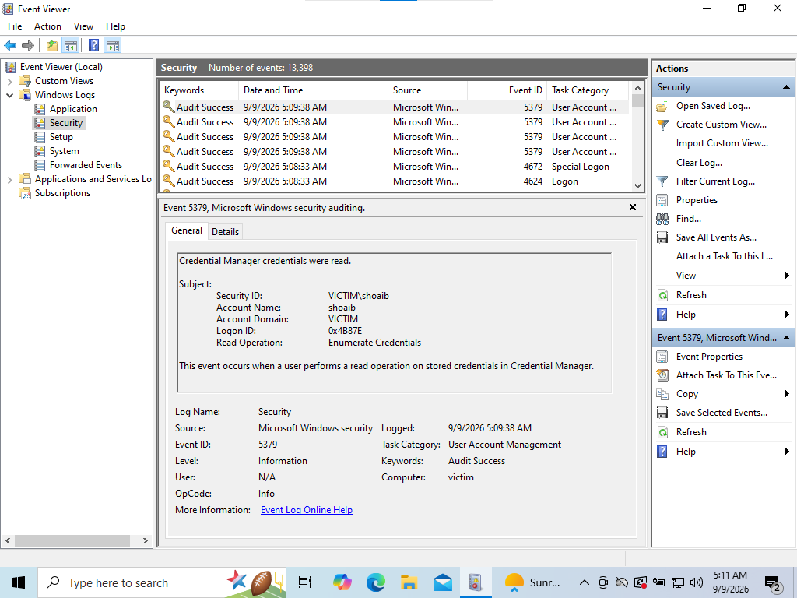

# 05 — Windows Endpoint Configuration

## 1. Overview

The Windows 10 virtual machine acts as the monitored endpoint in the SOC Analyst Homelab.

The endpoint represents a workstation in a small enterprise environment where operating system activity and security telemetry can be collected and analyzed by the SOC monitoring platform.

The endpoint is configured with:

- Windows 10
- Sysmon
- Wazuh Agent
- Windows Event Logs

---

## 2. Endpoint Configuration

| Setting | Value |
|---|---|
| Operating System | Windows 10 |
| Role | Victim / Monitored Endpoint |
| IP Address | `192.168.100.4` |
| Network | VirtualBox Internal Network |
| Lab Network | `192.168.100.0/24` |
| SIEM Server | Wazuh |
| Wazuh Server IP | `192.168.100.5` |

The Windows endpoint communicates with the Wazuh server through the isolated VirtualBox Internal Network.

---

## 3. Endpoint Role

The Windows 10 system serves as the primary telemetry source for the SOC homelab.

Its responsibilities include:

- Generate normal Windows operating system activity.
- Generate Windows Security events.
- Generate enhanced endpoint telemetry through Sysmon.
- Run the Wazuh Agent.
- Forward configured security telemetry to the Wazuh server.
- Act as the target system for future controlled security-testing scenarios.

---

## 4. Windows Event Logs

Windows Event Logs provide important operating system and security information that can be used during SOC investigations.

Relevant Windows event sources in the lab include:

- Security
- System
- Application
- Sysmon Operational

Windows Security events were verified locally using Windows Event Viewer.

Evidence:



This confirms that security auditing information is available on the monitored endpoint.

---

## 5. Sysmon

Sysmon is installed on the Windows endpoint to provide enhanced endpoint visibility.

Sysmon telemetry can provide additional information about system activity, including process execution.

The relevant Sysmon event channel used by this project is:

```text
Microsoft-Windows-Sysmon/Operational
```

Sysmon events were verified locally through Windows Event Viewer.

Evidence:

This confirms that Sysmon is installed and generating endpoint telemetry.

## 6. Wazuh Agent
The Wazuh Agent is installed on the Windows endpoint and provides the connection between the endpoint telemetry and the Wazuh SIEM.

The agent is responsible for collecting configured Windows event channels and forwarding telemetry to the Wazuh environment.

The endpoint was successfully registered with Wazuh and verified as active.

Evidence:

The active status confirms successful communication between:
```
 Windows Endpoint
       |
       v
Wazuh Agent
       |
       v
Wazuh Server
```
## 7. Sysmon Event Collection
To collect Sysmon events, the Wazuh Agent configuration includes the Sysmon Operational event channel.
```<localfile>
  <location>Microsoft-Windows-Sysmon/Operational</location>
  <log_format>eventchannel</log_format>
</localfile>
```
After configuration changes, the Wazuh Agent can be restarted using an elevated PowerShell session:
```Restart-Service -Name Wazuh```
The service status can be verified with:
```Get-Service -Name Wazuh```
The expected operational state is:
```Running```

## 8. Benign Telemetry Generation
To validate endpoint telemetry without performing a malicious action, benign Windows process activity was generated.
For example:
```Start-Process notepad.exe```
after allowing the process activity to be recorded, the process can be closed normally or stopped using:
```Stop-Process -Name notepad```

The resulting process activity was used to verify the telemetry pipeline.

## 9. Local Telemetry Validation
Before searching for the activity in Wazuh, telemetry was first validated locally on the Windows endpoint.
The validation process included:
```
Generate benign process activity.
Open Windows Event Viewer.
Navigate to the Sysmon Operational event channel.
Verify that Sysmon generated a process creation event.
Confirm that the event corresponds to the generated activity.
```
This approach helps determine whether telemetry generation is working before troubleshooting SIEM ingestion.

## 10. Wazuh Telemetry Validation
After confirming the event locally, the corresponding telemetry was searched in Wazuh.

Evidence:

Successful visibility in Wazuh validates the following pipeline:
```
Windows Process Activity
        |
        v
      Sysmon
        |
        v
Windows Event Log
        |
        v
   Wazuh Agent
        |
        v
   Wazuh Server
        |
        v
  Wazuh Dashboard
```

This confirms that endpoint activity can be collected and analyzed centrally.

## 11. Endpoint Validation Summary
The Windows endpoint was considered successfully configured after confirming:
```The endpoint was connected to the internal lab network.
Windows Security events were generated.
Sysmon was installed and generating events.
The Wazuh Agent was running.
The endpoint appeared as active in Wazuh.
Windows telemetry reached the Wazuh SIEM.
Sysmon process telemetry was visible in Wazuh.
```


