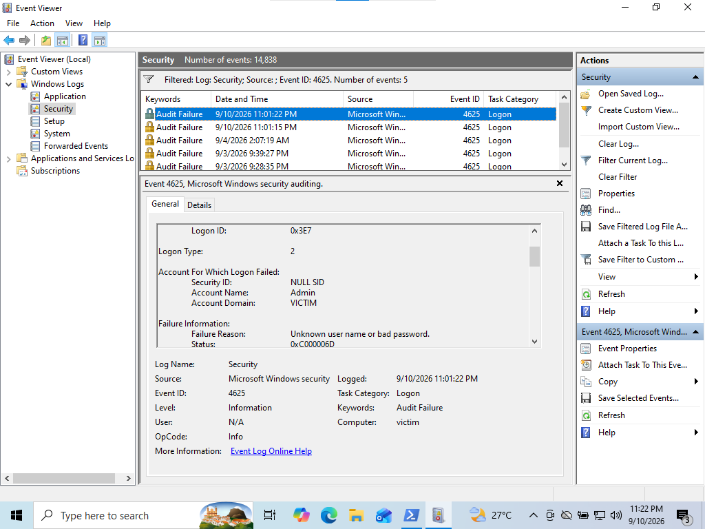
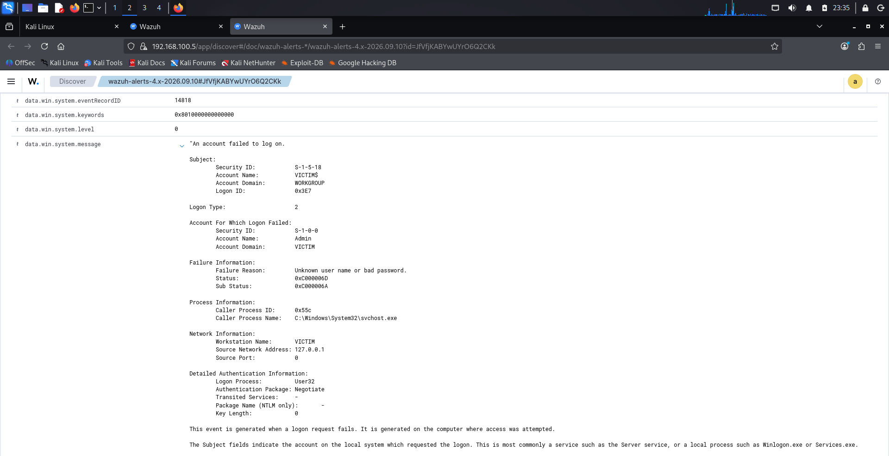
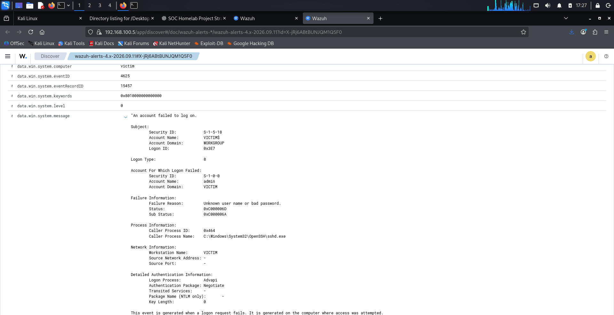
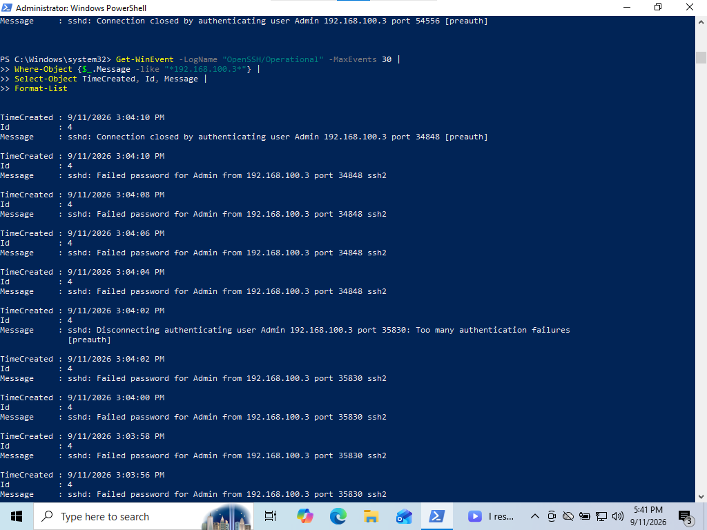
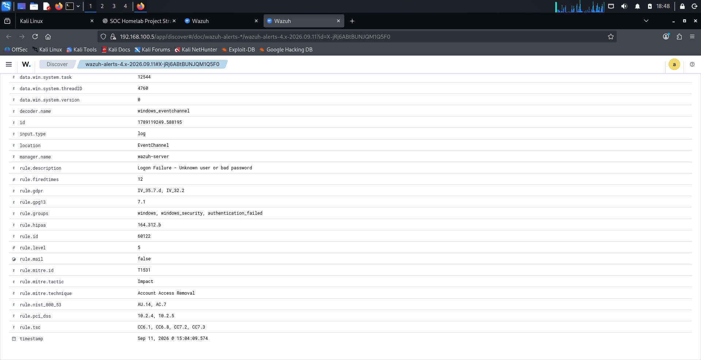

# Project 2 — SSH Brute-Force Detection & Investigation

## Overview

This project demonstrates a controlled SSH password-guessing simulation against a Windows 10 endpoint inside an isolated SOC homelab.

The objective was to generate repeated authentication failures, detect the activity using Windows Security logs and Wazuh, correlate multiple log sources, identify the source of the authentication attempts, and determine whether the targeted account was successfully accessed.

The investigation was performed from the perspective of an entry-level SOC analyst, focusing on detection, log analysis, event correlation, incident investigation, and evidence-based conclusions.

## Lab Environment

| System | Role | IP Address |
|---|---|---|
| Kali Linux | Controlled attack/test machine | `192.168.100.3` |
| Windows 10 | Monitored endpoint | `192.168.100.4` |
| Wazuh Server | SIEM / log analysis | `192.168.100.5` |

### Security Tools and Telemetry

- Wazuh SIEM
- Wazuh Agent
- Windows Security Event Logs
- Windows OpenSSH
- Sysmon
- Kali Linux
- Hydra
- VirtualBox Internal Network

## Investigation Objective

The investigation was designed to answer four primary questions:

1. Were repeated authentication failures generated on the Windows endpoint?
2. Were those authentication events visible and detectable in Wazuh?
3. Could the source of the authentication attempts be identified through log correlation?
4. Did the observed password-guessing activity result in a successful SSH password authentication?
   
## Investigation

### 1. Baseline Failed Authentication

Before generating repeated authentication attempts, a single failed local Windows logon was generated to establish a baseline.

Windows recorded:

- Event ID: `4625`
- Account: `Admin`
- Logon Type: `2` — Interactive
- Status: `0xC000006D`
- SubStatus: `0xC000006A`
- Source Address: `127.0.0.1`

The same event was verified in Wazuh, confirming that Windows authentication telemetry was successfully reaching the SIEM.

### 2. Controlled SSH Password-Guessing Simulation

A small controlled password list was used from the Kali Linux test machine to generate repeated SSH authentication attempts against the Windows `Admin` account.

The activity produced nine failed Windows authentication events within approximately 16 seconds.

Observed characteristics:

| Field | Observation |
|---|---|
| Windows Event ID | `4625` |
| Target Account | `Admin` |
| Logon Type | `8` |
| Failure Status | `0xC000006D` |
| Failure SubStatus | `0xC000006A` |
| Failed Attempts | 9 |
| First Failure | 3:03:52 PM |
| Last Failure | 3:04:08 PM |
| Duration | ~16 seconds |

The short duration, repeated failures, and consistent target account indicated possible automated password-guessing activity.

### 3. Source IP Correlation

The Windows Security 4625 events did not provide a source network address for this OpenSSH authentication path.

Instead of assuming the source, the Windows `OpenSSH/Operational` log was investigated as an additional telemetry source.

OpenSSH recorded repeated messages showing:

- Failed password authentication
- Target account: `Admin`
- Source IP: `192.168.100.3`
- Protocol: SSH2

This correlated the repeated authentication activity with the Kali Linux test machine.

### 4. Wazuh Detection

Wazuh detected the failed authentication activity using:

- Rule ID: `60122`
- Rule Level: `5`
- Description: `Logon failure - Unknown user or bad password`
- Rule Group: `authentication_failed`

This confirmed that the authentication failures were collected and classified by the SIEM.

