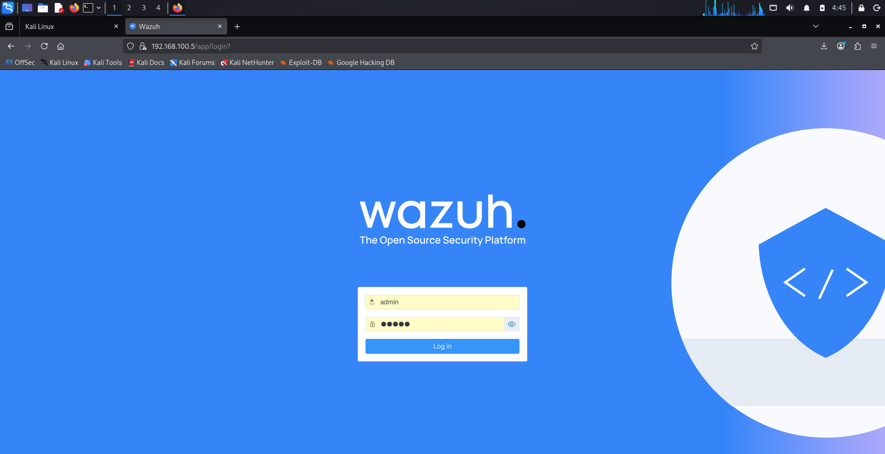
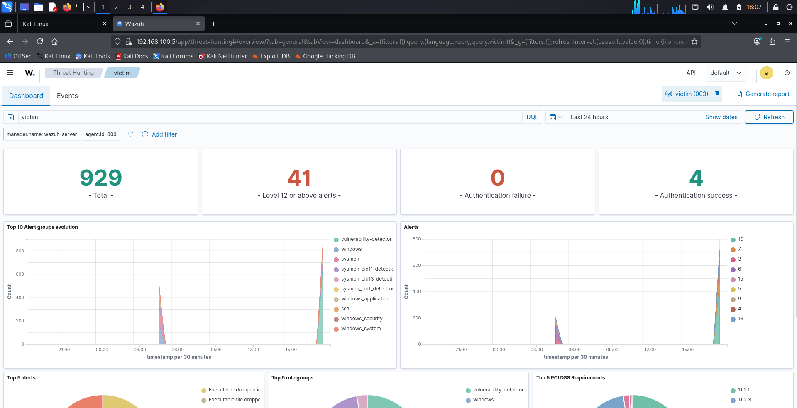
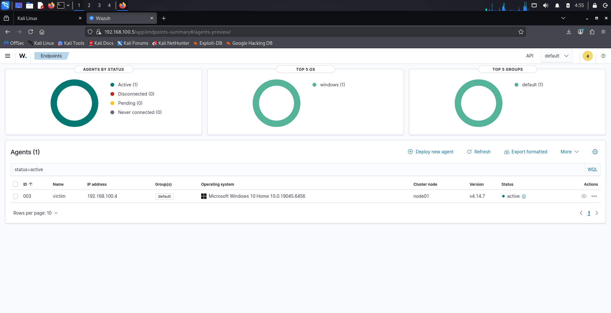
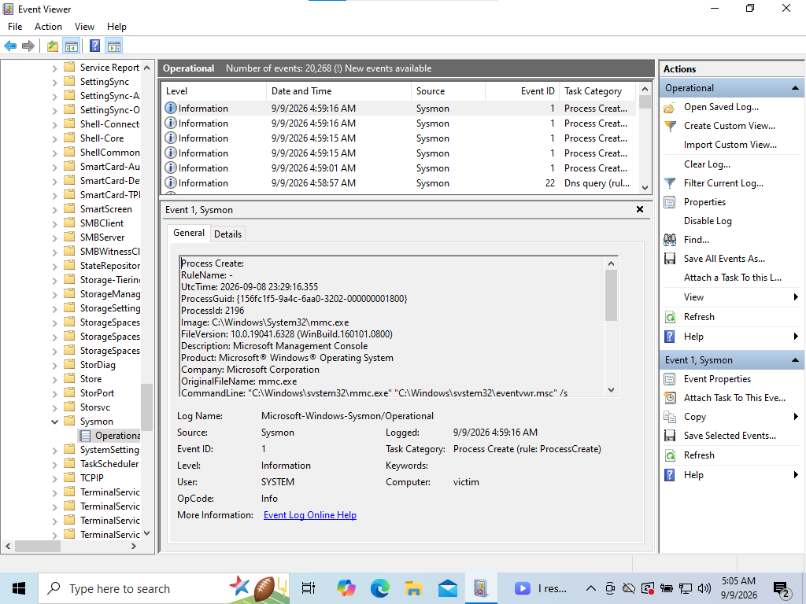
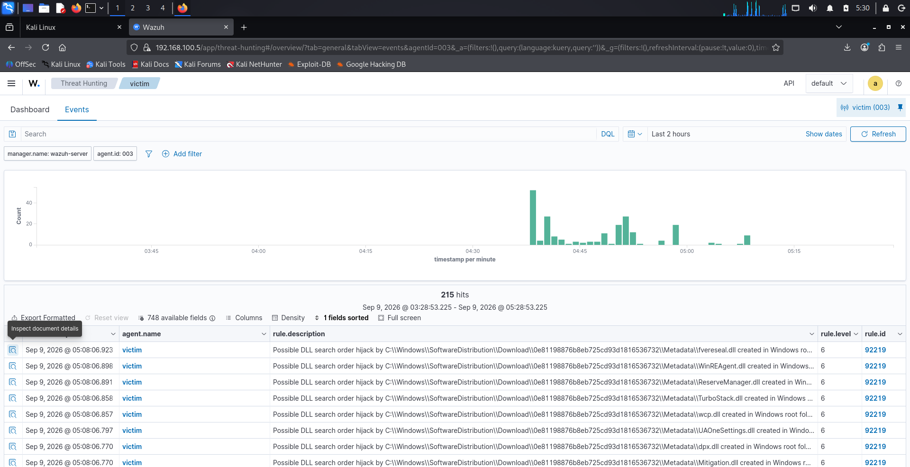
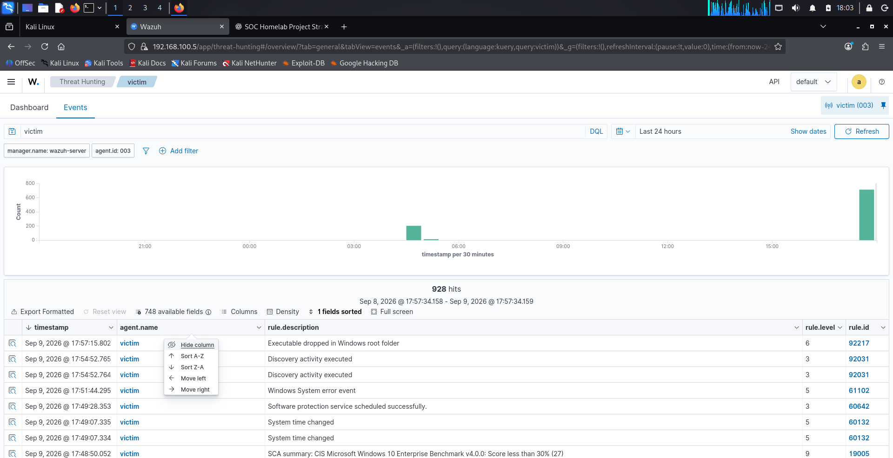

# Evidence Screenshots

This directory contains validation evidence captured during the deployment and testing of the SOC Analyst Homelab.

The screenshots demonstrate the complete telemetry pipeline from the Windows endpoint through Sysmon and the Wazuh Agent to the Wazuh SIEM.

## Evidence

### 1. Wazuh Dashboard Access

Confirms that the Wazuh web interface is reachable from the lab environment.

### 2. Wazuh Dashboard

Confirms successful access to the operational Wazuh Dashboard used for security monitoring and investigation.

### 3. Windows Endpoint Active

Confirms that the Windows 10 endpoint is successfully registered with the Wazuh server and reporting an active agent status.

### 4. Sysmon Operational Events

Confirms that Sysmon is installed and generating endpoint telemetry within the Windows Sysmon Operational event channel.

### 5. Windows Security Events

Confirms that Windows Security auditing is generating security events on the monitored endpoint.

### 6. Windows Events in Wazuh

Confirms that Windows endpoint events are successfully forwarded by the Wazuh Agent and are available for analysis in the Wazuh SIEM.

### 7. Sysmon Telemetry in Wazuh

Confirms end-to-end Sysmon telemetry collection by demonstrating process telemetry generated on the Windows endpoint and successfully ingested into Wazuh.

## Validation Summary

The evidence validates the following monitoring pipeline:

`Windows Activity → Sysmon / Windows Event Logs → Wazuh Agent → Wazuh Server → Wazuh Dashboard → SOC Investigation`

All validation tests were performed within an isolated VirtualBox lab environment.

> **Security Note:** Screenshots are included only for educational and portfolio demonstration purposes.
